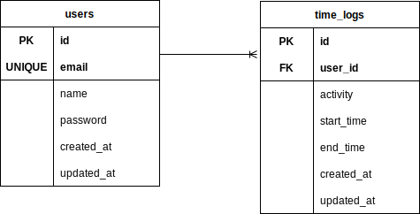

# 時間追跡アプリ 基本設計書

## 1. システム概要
時間追跡アプリは、ユーザーが活動内容と時間を記録し、統計データを可視化するWebアプリケーションです。本設計書では、システム構造、画面設計、データベース設計を記載します。

---

## 2. システム構造

### 2.1 構成図
- クライアント: ブラウザ (HTML/CSS/JavaScript)
- サーバー: PHP (ApacheまたはNginx)
- データベース: MySQL

---

### 2.2 ディレクトリ構成
```
project/
├── public/        # 静的ファイル (HTML/CSS/JS)
├── app/           # PHPアプリケーションロジック
├── config/        # 設定ファイル
├── database/      # マイグレーション・シード
├── doc/           # ドキュメント関係
└── resources/     # テンプレートファイル
```

## 3. 画面設計

### 3.1 ログイン画面
- **URL**: `/login`
- **機能**: ユーザー認証
- **UI要素**:
  - メールアドレス入力欄
  - パスワード入力欄
  - ログインボタン

### 3.2 ダッシュボード
- **URL**: `/dashboard`
- **機能**:
  - 登録済み活動の一覧表示
  - 統計の簡易表示
- **UI要素**:
  - 日付フィルタ
  - 活動追加ボタン
  - 統計表示セクション

### 3.3 活動記録画面
- **URL**: `/activity/add`
- **機能**: 活動内容を記録
- **UI要素**:
  - 活動名入力欄
  - 開始/終了時間入力欄
  - 保存ボタン

---

## 4. データベース設計

### 4.1 テーブル定義

#### users テーブル
| カラム名        | 型           | 主キー | 備考                  |
|-----------------|--------------|--------|-----------------------|
| id              | INT          | PK     | 自動インクリメント    |
| name            | VARCHAR(255) |        | ユーザー名            |
| email           | VARCHAR(255) | UNIQUE | メールアドレス         |
| password        | VARCHAR(255) |        | ハッシュ化されたパスワード |
| created_at      | TIMESTAMP    |        | 作成日時              |
| updated_at      | TIMESTAMP    |        | 更新日時              |

#### time_logs テーブル
| カラム名        | 型           | 主キー | 備考                  |
|-----------------|--------------|--------|-----------------------|
| id              | INT          | PK     | 自動インクリメント    |
| user_id         | INT          | FK     | usersテーブルのID     |
| activity        | VARCHAR(255) |        | 活動内容              |
| start_time      | TIMESTAMP    |        | 開始時刻              |
| end_time        | TIMESTAMP    |        | 終了時刻              |
| created_at      | TIMESTAMP    |        | 作成日時              |
| updated_at      | TIMESTAMP    |        | 更新日時              |

### 4.2 ER図

---

## 5. API設計

### 5.1 API一覧
| メソッド | エンドポイント          | 機能                    |
|----------|-------------------------|-------------------------|
| GET      | /api/time_logs          | 活動一覧の取得          |
| POST     | /api/time_logs          | 活動の新規登録          |
| PUT      | /api/time_logs/{id}     | 活動の編集              |
| DELETE   | /api/time_logs/{id}     | 活動の削除              |

---

## 6. テスト仕様
1. **ログイン機能**
   - 正しい資格情報でログインできること
   - 誤った資格情報でエラーが表示されること
2. **活動記録機能**
   - 活動が正しく保存されること
   - 保存したデータが一覧に表示されること
3. **統計表示機能**
   - 登録データに基づいた統計が正確に計算されること
